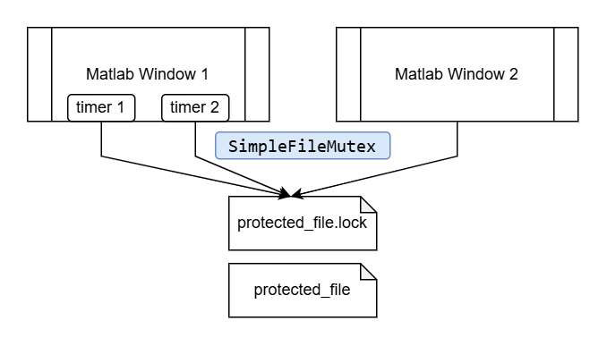

# MatlabSimpleFileMutex

A simple file-based mutex implementation for MATLAB that provides cross-process synchronization using Java FileLock mechanism. This tool helps prevent race conditions when multiple MATLAB processes (e.g. multiple MATLAB Windows) that need to access the same file concurrently.



## ⚙️ Setup

1. Clone or download this repository
   ```bash
   git clone https://github.com/hwyao/MatlabSimpleFileMutex
   ```
2. Start the project by double clicking `MatlabSimpleFileMutex.prj` or run
   ```matlab
   openProject('MatlabSimpleFileMutex.prj')
   ```

## ▶️ Quick Start

### Basic Usage

The mutex looks exactly same as the ones in other programming language:

```matlab
% Create a mutex for protecting a file
mutex = SimpleFileMutex('myfile.txt');

% Acquire the lock
mutex.lock();
% Do something ...
% Release the lock
mutex.unlock();
```

### Advanced Configuration

You can customize the mutex behavior with additional parameters:

```matlab
% Create mutex with custom parameters
mutex = SimpleFileMutex('myfile.txt', ...
    'UnexpectedRetryMax', 50, ...        % Max retries when unexpected errors occur
    'PauseTimeByLocking', 0.05, ...      % Pause time (seconds) between lock attempts  
    'MaxWaitTime', 30);                  % Max wait time (seconds) for acquiring lock, 0 = no limit
```

**Parameter Details:**
- `UnexpectedRetryMax`: Maximum number of retries when unexpected errors occur during lock acquisition (which I also don't know what can trigger this but probably from Java side) (default: 20)
- `PauseTimeByLocking`: Sleep time in seconds between lock acquisition attempts (default: 0.1)
- `MaxWaitTime`: Maximum time in seconds to wait for lock acquisition. Set to 0 for unlimited waiting (default: 0)

### Running the Example

To see the mutex in action with multiple MATLAB processes:

```matlab
mutex_example
```

In this file, there are `numberOfThreads` independent MATLAB windows started, each of them try to write `writesPerThread` times of its unique id `1-5` into a same file. You can change the behaviour to enable or disable the mutex: 
```matlab
numberOfThreads = 5;
writesPerThread = 100;

enable_mutex = true;
```

When enabling the mutex, the expected result is the seperatedly repeated ids:
```
1 1 1 1 1 1 1 ...
2 2 2 2 2 2 2 ...
...
```

When disabling the mutex, lines will be potentially mixed
```
1 1 2 1 2 1 1 1 2 1 ...
2 2 2 ...
...
```

Different machines will have different behaviour on race condition. Adapt `numberOfThreads`, `writesPerThread` as well as `maxWaitTime` will show the correct behaviour.

### Running the Test

If you can't have the expected behaviour in your machine, you can use run the test locally in your machine. The provided test is `test\SimpleFileMutexTest`. You can run it with [test Browser](https://www.mathworks.com/help/matlab/ref/testbrowser-app.html) or type the command:
```matlab
runtests
```

## 💡 Design idea

> **Hint!**
> 🤔 You might consider not to use this repository if all your code can happen in one Matlab window. You can first try:
> - [`parfor`](https://www.mathworks.com/help/parallel-computing/parallel-for-loops-parfor.html) in Parallel Computing Toolbox for direct parallelization (and might realize that this mutex is not necessary)
> - [`DataQueue`](https://www.mathworks.com/help/distcomp/parallel.pool.dataqueue.html) in Parallel Computing Toolbox to allow multiple sources to send request into queue and use a callback to handle the tasks.
> 
> 😆 You certainly need this toolbox if you have to start multiple MATLAB windows but have race condition between them.

This repository design idea is strongly based on 
- [atomically creating a file lock in MATLAB (file mutex) - Stackoverflow](https://stackoverflow.com/questions/3451343/atomically-creating-a-file-lock-in-matlab-file-mutex)
- [Semaphores and locks in MATLAB - Stackoverflow](https://stackoverflow.com/questions/6415283/semaphores-and-locks-in-matlab)

In short, to achieve a file mutex without inter-process comminucation, we need an external operation that ensures atomicity. Which could be:
- Commands like [`flock`](https://www.man7.org/linux/man-pages/man1/flock.1.html) (Provides system-wide file lock, but then Linux-specific)
- [Some old discussion](https://groups.google.com/g/comp.soft-sys.matlab/c/606-uHAOpEA?pli=1) about using `movefile`, which is(?) atomic. (Such undeclared, suspicious features are not something we can stably rely on)
- User implemented [shared matrix](http://www.mathworks.com/matlabcentral/fileexchange/28572-sharedmatrix) or [semaphore](http://www.mathworks.com/matlabcentral/fileexchange/45504-semaphoreposixandwindows), which is wonderful but a bit overkill by this simple requirement.
- ✅ Java's [FileLock](https://docs.oracle.com/javase/8/docs/api/java/nio/channels/FileLock.html), which Matlab usually provides and provide exclusive lock for file manipulation.

To validate that this works you can start two windows, and try this in first window:
```MATLAB
file = java.io.RandomAccessFile('test.txt', 'rw');
channel = file.getChannel();
lock = channel.lock();  
disp('MATLAB1 already lock this file, try access in another MATLAB window');
pause(30);  % Keep this 30 seconds
lock.release();
channel.close();
file.close();
disp('MATLAB1 release the lock.');
```

Then try this in second window:
```MATLAB
file2 = java.io.RandomAccessFile('test.txt', 'rw');
channel2 = file2.getChannel();
try
    lock2 = channel2.tryLock();  
    if isempty(lock2)
        disp('File locked from MATLAB2 process, tryLock failed!');
    else
        disp('MATLAB2 Successfully acquire lock2.');
        lock2.release();
    end
catch e
    disp(['ERROR: ' e.message]);
end
channel2.close();
file2.close();
```
(you can also try this in the first window by running the first code before `pause(30);`. You will have an specific exception. Remember to correctly release lock, channel and file after your experiment, otherwise you might need to restart MATLAB to delete the example txt)